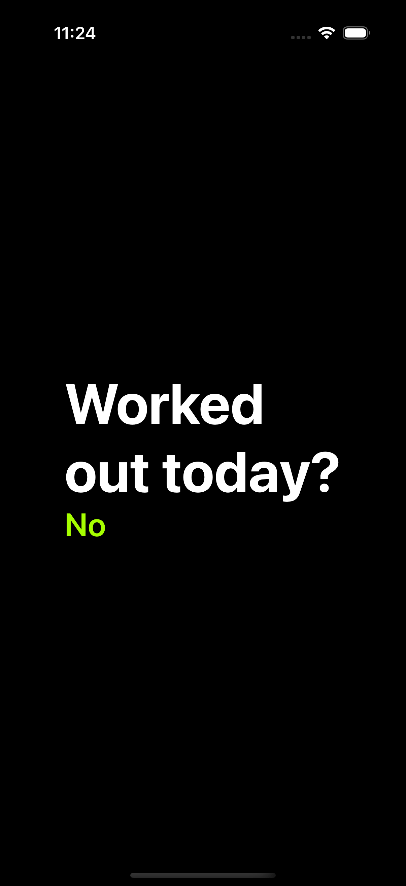
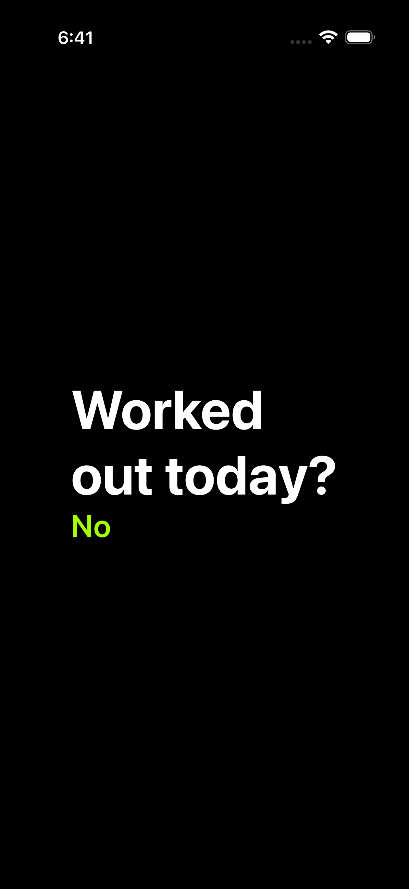
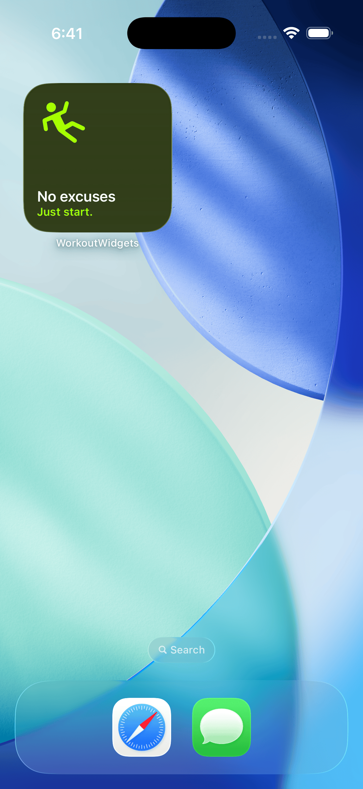
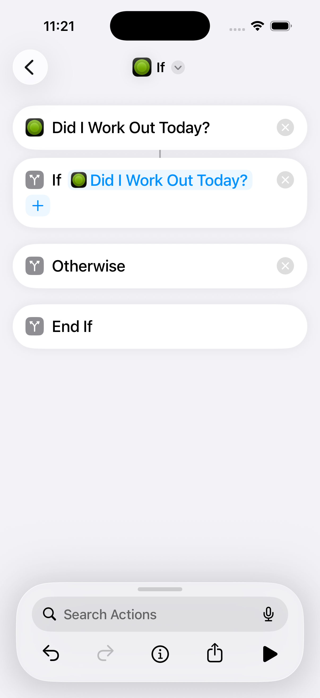

# WorkoutWidgetsApp

Dead-simple workout motivation app. Did you work out today?

|                                    |                                    |                                    |                                    |
| ---------------------------------- | ---------------------------------- | ---------------------------------- | ---------------------------------- |
|  |  |  |  |

## Overview

WorkoutWidgets is a tiny, privacy-first app that gives you a nudge to move your body today. It ships with a small widget collection so you can keep motivation right on your Home Screen or Lock Screen.

- No accounts, no analytics, no extra dependencies
- SwiftUI app with a WidgetKit extension
- Built to be distraction-free and lightweight

## Run it locally

There are no external dependencies or package managers to install.

Steps:

1. Open the project:
   - Double-click `WorkoutWidgets.xcodeproj`, or
   - From a terminal: `open WorkoutWidgets.xcodeproj`
2. In Xcode, select the `WorkoutWidgets` scheme.
3. Choose an iOS Simulator (or your connected device).
4. Press Run.

Notes:

- Widgets run on the same build. After launching the app once, add the widgets from your device/simulator widget gallery.
- If you run on a real device, the app will request Health permissions in the future depending on features; it doesn’t require any third-party services.

## Project structure

- `WorkoutWidgets/` – Main SwiftUI app target
- `WidgetsCollection/` – WidgetKit extension using App Intents
- `Models/`, `Services/`, `Tasks/`, `Views/` – App building blocks

## License

This project is licensed under the terms of the MIT License. See `LICENSE` for details.
